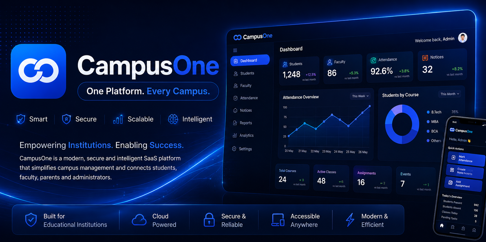

<!-- ========================================================= -->
<!--                     CAMPUSONE ORGANIZATION                -->
<!--                  Official GitHub Profile README           -->
<!-- ========================================================= -->

<p align="center">



</p>

<br>

<p align="center">


</p>

<h1 align="center">

CampusOne

</h1>

<p align="center">

<b>One Platform. Every Campus.</b>

</p>

<p align="center">

Modern Operating System for Educational Institutions

</p>

<br>

<p align="center">

CampusOne is a modern SaaS platform designed to simplify academic administration,
student lifecycle management, faculty operations, attendance, communication,
analytics and institutional workflows through one secure cloud ecosystem.

Built for schools, colleges, universities and training institutes,
CampusOne replaces disconnected systems with one intelligent platform.

</p>

---

## Quick Overview

<table>

<tr>

<td align="center">


<br><br>

<b>Cloud Native</b>

<br>

Built for modern cloud infrastructure.

</td>

<td align="center">


<br><br>

<b>Enterprise Security</b>

<br>

Authentication, authorization and data protection.

</td>

<td align="center">


<br><br>

<b>Cross Platform</b>

<br>

Web, Mobile and Progressive Web App.

</td>

<td align="center">


<br><br>

<b>Highly Scalable</b>

<br>

Designed for institutions of every size.

</td>

</tr>

</table>

---

## Company

CampusOne is building the next generation digital operating system
for educational institutions.

Instead of using multiple disconnected software solutions for attendance,
academics, communication, administration and reporting,
CampusOne connects everything through one integrated experience.

Our goal is simple:

> Build software that allows institutions to focus on education,
> while CampusOne manages technology.

---

## At a Glance

<table>

<tr>

<td align="center">

<h2>12+</h2>

Platform Modules

</td>

<td align="center">

<h2>100%</h2>

Cloud Based

</td>

<td align="center">

<h2>PWA</h2>

Ready

</td>

<td align="center">

<h2>RBAC</h2>

Security Model

</td>

</tr>

</table>

---

## Vision

To become the digital operating system powering educational institutions across India and beyond.

---

## Mission

Deliver secure, scalable and intelligent technology that improves
administration, communication and the complete academic experience.

---

## Core Principles

- Security by Design
- Simplicity First
- Cloud Native Architecture
- Mobile First Experience
- Performance Driven
- Built for Scale
- Developer Friendly
- Institution Focused

---

<p align="center">


<a href="https://github.com/CampusOneApp">GitHub</a>

&nbsp;&nbsp;&nbsp;


<a href="https://linkedin.com/company/campusone">LinkedIn</a>

&nbsp;&nbsp;&nbsp;


<a href="https://campusone.app">Website</a>

</p>

---

<!-- End of Part 1 -->
<!-- ========================================================= -->
<!--                     CORE PRODUCTS                         -->
<!-- ========================================================= -->

<br>

<h2 align="center">Core Products</h2>

<p align="center">

CampusOne delivers a complete digital ecosystem that connects every department,
every classroom and every stakeholder through one intelligent cloud platform.

</p>

<br>

<table width="100%">

<tr>

<td width="50%" valign="top">


### CampusOne Web

Modern web application built for educational institutions.

**Key Features**

- Student Information System
- Faculty Management
- Attendance Tracking
- Academic Records
- Notice Board
- Timetable
- Examination Management
- Reports & Analytics

</td>

<td width="50%" valign="top">


### CampusOne Admin

Enterprise administration workspace for institutional leadership.

**Key Features**

- Dashboard
- User Management
- Department Management
- Permissions
- Institution Settings
- Academic Sessions
- Reports
- Audit Logs

</td>

</tr>

<tr>

<td width="50%" valign="top">


### CampusOne Mobile

Stay connected from anywhere.

**Key Features**

- Attendance
- Notifications
- Results
- Assignments
- Timetable
- Notices
- Student Profile
- Secure Login

</td>

<td width="50%" valign="top">


### CampusOne Cloud

Secure infrastructure powering the complete platform.

**Key Features**

- Authentication
- Cloud Storage
- Firestore Database
- Real-time Sync
- Automatic Backup
- Secure APIs
- Monitoring
- High Availability

</td>

</tr>

</table>

---

# Platform Modules

<p align="center">

Every institution is different.

CampusOne provides modular architecture so organizations can enable only the
features they need.

</p>

<br>

| Module | Description |
|--------|-------------|
|  **Student Management** | Complete student lifecycle management from admission to graduation. |
|  **Faculty Portal** | Teaching, attendance, schedules and academic workflows. |
|  **Attendance System** | QR, biometric and manual attendance with analytics. |
|  **Communication Hub** | Announcements, notices and institutional messaging. |
|  **Parent Portal** | Attendance, progress reports and important updates. |
|  **Analytics & Reports** | Interactive dashboards and institutional insights. |
|  **Document Center** | Cloud document storage and digital records. |
|  **Enterprise Security** | Role-based permissions and secure authentication. |

---

## Product Highlights

<table width="100%">

<tr>

<td align="center">

<h3>Cloud Native</h3>

Designed for scalability and performance.

</td>

<td align="center">

<h3>Real-Time</h3>

Instant synchronization across devices.

</td>

<td align="center">

<h3>Secure</h3>

Enterprise-grade authentication and access control.

</td>

</tr>

<tr>

<td align="center">

<h3>Responsive</h3>

Desktop, tablet and mobile optimized.

</td>

<td align="center">

<h3>PWA Ready</h3>

Installable web experience.

</td>

<td align="center">

<h3>Modular</h3>

Enable only the features your institution requires.

</td>

</tr>

</table>

---

<p align="center">

<b>Built for Schools</b> •
<b>Colleges</b> •
<b>Universities</b> •
<b>Coaching Institutes</b> •
<b>Training Centers</b>

</p>

---

<!-- End of Part 2 -->
<!-- ========================================================= -->
<!--                    PRODUCT SHOWCASE                       -->
<!-- ========================================================= -->

<br>

<h2 align="center">Product Showcase</h2>

<p align="center">

Designed with a modern interface focused on simplicity, speed and productivity.

</p>

---

## CampusOne Dashboard

<p align="center">


</p>

<p align="center">

The administrative dashboard provides a unified workspace for managing students,
faculty, attendance, academic records, analytics and institutional operations.

</p>

---

## Mobile Experience

<p align="center">


</p>

<p align="center">

CampusOne Mobile keeps students, faculty and parents connected through
attendance, notices, assignments, schedules and academic updates.

</p>

---

## Enterprise Security

<table>

<tr>

<td width="70%" valign="top">

CampusOne is designed with security as a core principle.

The platform includes:

- Role-Based Access Control (RBAC)
- Secure Authentication
- Encrypted Cloud Storage
- Protected APIs
- Real-time Data Synchronization
- Automated Backups
- Permission Management
- Secure Document Storage

</td>

<td width="30%" align="center">


</td>

</tr>

</table>

---

# Technology Stack

<p align="center">


&nbsp;&nbsp;


&nbsp;&nbsp;


&nbsp;&nbsp;


</p>

<table>

<tr>

<td align="center">

### Frontend

HTML5

CSS3

JavaScript

Responsive UI

</td>

<td align="center">

### Backend

Firebase

Firestore

Authentication

Storage

</td>

<td align="center">

### Platform

Cloud Native

Progressive Web App

REST APIs

Real-time Sync

</td>

<td align="center">

### Security

Authentication

Role Management

Protected Data

Secure Access

</td>

</tr>

</table>

---

# Why CampusOne?

<table>

<tr>

<td>

### One Platform

Everything required to manage a modern institution from one unified system.

</td>

<td>

### Built for Scale

Designed to support small schools as well as multi-campus institutions.

</td>

</tr>

<tr>

<td>

### Modern Experience

Clean interface, responsive design and intuitive workflows.

</td>

<td>

### Future Ready

Built on cloud technologies with modular architecture for continuous growth.

</td>

</tr>

</table>

---

<p align="center">

<b>Simple.</b>

•

<b>Secure.</b>

•

<b>Scalable.</b>

•

<b>Future Ready.</b>

</p>

---

<!-- End of Part 3 -->
<!-- ========================================================= -->
<!--            ARCHITECTURE • ENGINEERING • ECOSYSTEM         -->
<!-- ========================================================= -->

<br>

<h2 align="center">Architecture</h2>

<p align="center">

Designed with a modular, scalable and cloud-native architecture that enables
educational institutions to grow without changing their technology stack.

</p>

---

## Platform Architecture

```text
                Students
                    │
                    │
     ┌──────────────┼──────────────┐
     │              │              │
 Faculty         Parents      Administration
     │              │              │
     └──────────────┼──────────────┘
                    │
            CampusOne Platform
                    │
     ┌──────────────┼──────────────┐
     │              │              │
 Authentication   Firestore   Cloud Storage
     │              │              │
     └──────────────┼──────────────┘
                    │
              Firebase Cloud
```

---

# Engineering Principles

<table>

<tr>

<td>

### Security First

Every feature is designed with authentication,
authorization and data protection in mind.

</td>

<td>

### Performance

Optimized for fast loading,
minimal latency and responsive interactions.

</td>

</tr>

<tr>

<td>

### Scalability

Supports institutions ranging from
small schools to multi-campus universities.

</td>

<td>

### Maintainability

Modular architecture that is easy
to extend and maintain.

</td>

</tr>

</table>

---

# Repository Ecosystem

<table>

<tr>

<td>

### CampusOne-Web

Main web application.

</td>

<td>

### CampusOne-Admin

Administrative dashboard.

</td>

</tr>

<tr>

<td>

### CampusOne-Mobile

Mobile experience.

</td>

<td>

### CampusOne-Docs

Official documentation.

</td>

</tr>

<tr>

<td>

### CampusOne-Brand

Brand assets, logos and design system.

</td>

<td>

### .github

Organization profile and community files.

</td>

</tr>

</table>

---

# Development Workflow

```text
Planning
    │
Design
    │
Development
    │
Testing
    │
Review
    │
Deployment
    │
Continuous Improvement
```

---

# Code Standards

- Modular Architecture
- Reusable Components
- Clean Folder Structure
- Responsive Design
- Accessibility Focused
- Performance Optimized
- Version Controlled
- Well Documented

---

# Built With

<table>

<tr>

<td align="center">

HTML5

</td>

<td align="center">

CSS3

</td>

<td align="center">

JavaScript

</td>

<td align="center">

Firebase

</td>

<td align="center">

Firestore

</td>

<td align="center">

GitHub

</td>

</tr>

</table>

---

<p align="center">

Modern Architecture • Secure Foundation • Continuous Development

</p>

---

<!-- End of Part 4 -->
<!-- ========================================================= -->
<!--           ROADMAP • COMMUNITY • CONTACT • FOOTER          -->
<!-- ========================================================= -->

<br>

<h2 align="center">Product Roadmap</h2>

<p align="center">

CampusOne is continuously evolving to deliver a complete digital ecosystem for educational institutions.

</p>

---

## Current Release

| Version | Status | Description |
|----------|--------|-------------|
| v1.0 | Active Development | Core platform, authentication, dashboard and institutional management. |

---

## Upcoming Releases

| Release | Planned Features |
|----------|------------------|
| v1.1 | Attendance Improvements, Notice Board |
| v1.2 | Parent Portal, Reports |
| v1.3 | Mobile Application |
| v1.4 | Examination Module |
| v1.5 | AI Assistant |
| v2.0 | Multi-Campus Management |

---

# Open Development

CampusOne is being developed with long-term scalability in mind.

Every feature follows modern engineering principles with a strong focus on maintainability, performance and security.

---

# Documentation

Official documentation will include:

- Installation Guide
- Administrator Guide
- Student Guide
- Faculty Guide
- API Documentation
- Security Practices
- Deployment Guide
- Development Standards

---

# Community

CampusOne welcomes developers, designers and educators interested in building better educational technology.

Future community initiatives will include:

- Issue Tracking
- Feature Requests
- Discussions
- Documentation Contributions
- Design Contributions

---

# Contact

<table>

<tr>

<td>

### GitHub

https://github.com/CampusOneApp

</td>

<td>

### LinkedIn

https://linkedin.com/company/campusone

</td>

</tr>

<tr>

<td>

### Website

https://campusone.app

</td>

<td>

### Email

contact@campusone.app

</td>

</tr>

</table>

---

# License

Copyright © 2026 CampusOne.

All rights reserved.

---

<p align="center">


</p>

<h2 align="center">

CampusOne

</h2>

<p align="center">

<b>One Platform. Every Campus.</b>

</p>

<p align="center">

Building the future of education technology through secure,
scalable and intelligent software.

</p>

<br>

<p align="center">

<a href="https://github.com/CampusOneApp">

</a>

&nbsp;

<a href="https://linkedin.com/company/campusone">

</a>

&nbsp;

<a href="https://campusone.app">

</a>

</p>

---

<p align="center">

Made with dedication for modern education.

</p>

<!-- ========================================================= -->
<!--                  END OF README                            -->
<!-- ========================================================= -->